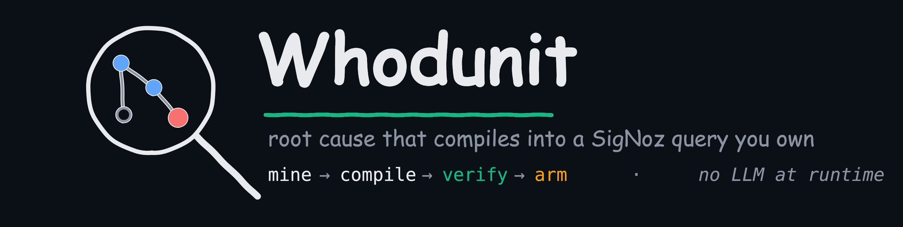
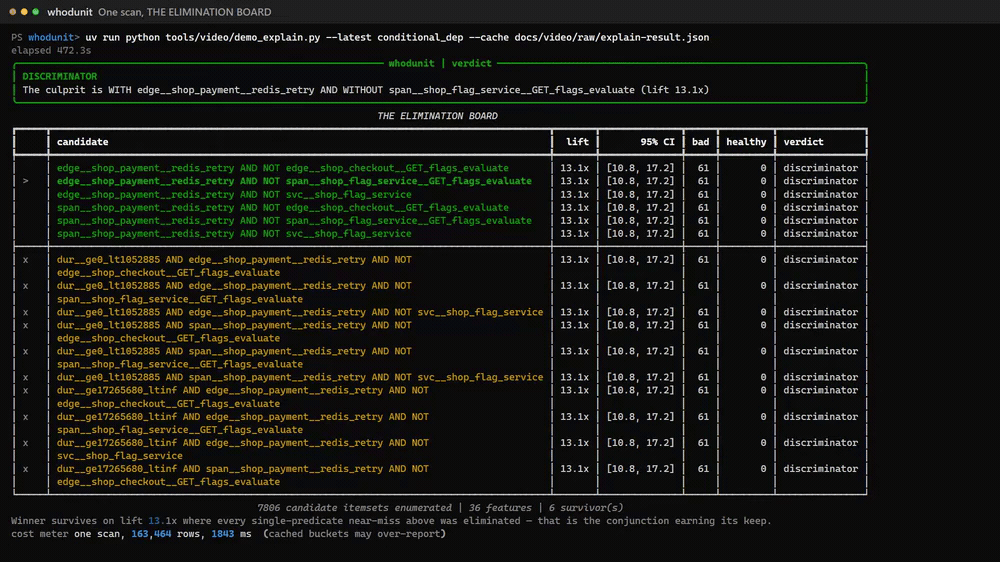
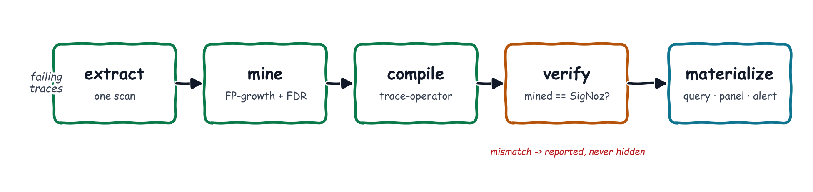
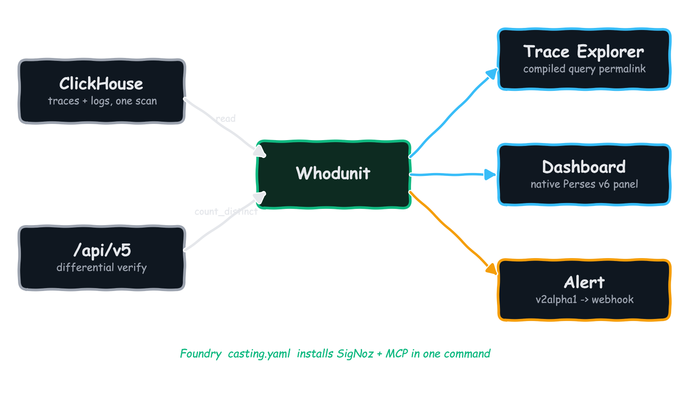

<p align="center">
  
</p>

<p align="center">
  <b>Deterministic structural root-cause analysis whose output is a SigNoz query you own.</b><br>
  <i>Everyone can show you the difference between two sets of traces. Only SigNoz can arm it.</i>
</p>




**▶ [Try it live → wiz-abhi-whodunit-replay.static.hf.space](https://wiz-abhi-whodunit-replay.static.hf.space)** — step through the real seed-778 run in your browser, no install required.

---

## What it is

> Point Whodunit at a set of failing traces. It matches a healthy cohort, mines the span /
> edge / log patterns that *structurally* separate the two, **compiles the winner into a
> valid SigNoz `builder_trace_operator` query**, verifies that query against the live
> engine, and arms it as an alert. The deliverable is never a paragraph — it's a Query
> Builder artifact you own: a Trace Explorer permalink, a dashboard panel, and a tripwire.

Every product in this space — Honeycomb BubbleUp, Datadog Trace Patterns, Chronosphere DDx,
Grafana `compare()` — stops at a *ranking a human then re-types by hand*. Whodunit closes the
loop: **mine → compile → verify → arm.** It's the implementation of
[SigNoz/signoz#1957](https://github.com/SigNoz/signoz/issues/1957) — *"Enable a way to compare
2 sets of filtered spans"* — opened by co-founder pranay01 in January 2023 and still open.
And there is **no LLM anywhere in the runtime**: the same input plus seed always produces the
same verdict hash.

## The hero beat

It's 3 a.m. Checkout is throwing errors — but only *sometimes*, and every dashboard is green.
You point Whodunit at the failing traces:

```bash
whodunit explain --bad "checkout errors, last 20m" --match-baseline
```

**One** ClickHouse scan. 7,806 candidate patterns enumerated locally. The elimination board
fills in — and the machine *rejects the obvious answers*:

- the `payment ⇒ redis-retry` edge on its own? **in the healthy traces too.**
- the missing `flag-service` on its own? **also in both cohorts.**
- only the **conjunction** — that edge *and* no flag-service — separates them, at **13.1× lift**: 61 bad traces, 0 healthy.

Then it compiles that finding into SigNoz's own language, `(A ⇒ B) && NOT C`, runs it back
against the live engine, and prints the receipt:

```
mined 61  |  SigNoz 61  |  MATCH  |  precision 1.00  |  recall 1.00
```

Paste the generated permalink into Trace Explorer — the result set collapses to exactly those
61 traces. One flag (`--arm`) turns it into a live alert whose webhook fires end-to-end. **No
model wrote any of it**, and running it again lands the identical verdict hash.

## How it works



Five stages, no LLM in any of them:

- **extract** — one `clickhouse_sql` scan builds a per-`trace_id` boolean feature matrix (span
  predicates from raw `duration_nano`, `parent_span_id` edges, ancestor walks, and log features
  joined by `trace_id` from the **same** store). A case-control matcher picks the healthy cohort
  on the selection axis, so the discriminator can never just *be* the selection axis.
- **mine** — hand-rolled FP-growth enumerates the complete itemset lattice **before** any test
  runs (so Benjamini–Hochberg FDR is valid, not post-selection inference), ranks by lift with
  bootstrap CIs gated on effect size, and treats **abstention as a first-class outcome**.
- **compile → verify → materialize** — the winner becomes a valid trace-operator envelope,
  gets run back via `/api/v5/query_range` and asserted equal to the local count, then ships as a
  permalink + Perses v6 panel + v2alpha1 alert.

## How it uses SigNoz



Whodunit doesn't merely *send data to* SigNoz — it reads, computes against, and writes back
into **all five surfaces**, and installs through Foundry:

| Surface | How Whodunit uses it |
|---|---|
| **Traces + Logs** | One `clickhouse_sql` scan joins traces ⋈ logs by `trace_id` — a cross-signal join impossible on Tempo + Loki (separate stores). |
| **Query Builder** | The output *is* a first-class `builder_trace_operator` expression, verified via `/api/v5/query_range`. |
| **Dashboards** | The discriminator is emitted as a native Perses **v6** panel. |
| **Alerts** | Armed as a **v2alpha1** WARN/CRIT rule; the fired webhook was caught end-to-end at **t+182s**. |
| **Foundry** | `deploy/casting.yaml` installs SigNoz **and** the MCP server in one command. |

## Quickstart

Three commands, from an empty machine to a verified verdict:

```bash
# 1. Stand up SigNoz + its MCP server via Foundry.
foundryctl cast -f deploy/casting.yaml

# 2. Seed a disclosed, deterministic demo corpus (8-service shop, one conjunctive fault).
python -m corpus.generate --traces 800 --seed 778 \
    --fault conditional_dep --endpoint http://localhost:4318

# 3. Explain it: extract → mine → compile → verify, all against live SigNoz.
export SIGNOZ_URL=http://localhost:8080 SIGNOZ_EMAIL=... SIGNOZ_PASSWORD=... SIGNOZ_ORG_ID=...
whodunit explain --from-manifest corpus/out/manifest-<runid>.json
```

Add `--arm` (live alert), `--dashboard` (v6 panel), or `--json`. Run `cast` on a clean host —
the dev stack already holds `:8080`/`:4318`. Full pristine-corpus steps in
[`docs/DEMO-RUNBOOK.md`](docs/DEMO-RUNBOOK.md).

## The research story — 6/6, and the one it first got wrong

Six scenarios, run **live** against the stack, scored against a machine-checkable ground-truth
manifest, versus a properly-implemented (not strawman) BubbleUp-style flat baseline
([`benchmark/REPORT.md`](benchmark/REPORT.md)):

| scenario | whodunit | flat baseline |
|---|---|---|
| `conditional_dep` — the conjunctive fault | **discriminator** ✓ | **fails** (0.23 precision) |
| `new_edge`, `cache_bypass` — single-feature | **discriminator** ✓ | ties (their home turf) |
| `retry_storm` — N+1, inexpressible | partial ✓ (abstains from a culprit) | fails |
| `decoys`, `null_scenario` — nothing real | **abstain** ✓ | fails |

Whodunit nails the conjunction flat tools structurally cannot see, **ties honestly** where a
single feature is enough, and abstains rather than inventing a culprit. Never a false culprit
across six scenarios.

The most useful row is the one it *first failed*: `cache_bypass` originally **abstained** — the
pure-absence discriminator was soundly refused by the compiler while the miner's parsimony prune
dropped the compilable superset. The fix recovers the best *compilable* near-miss at a tied
confidence floor; the original failure is preserved in
[`benchmark/ISSUES.md`](benchmark/ISSUES.md) #2. Finding that seam and fixing it in the open is
exactly what this project is for.

## Honest limits

- **Repetition / N+1 faults are inexpressible.** The trace-operator algebra has no per-trace
  cardinality qualifier, so "2–5 retries vs 1" can't be a presence discriminator. Whodunit
  **abstains** rather than fabricate one.
- **Pure-absence needs a positive anchor** — `NOT C` alone returns zero spans; absence is only
  expressible as `A && NOT C`.
- **The corpus is synthetic and disclosed.** Ground truth comes from a manifest, not human
  judgement — a methodology strength (exact labels) and a caveat (no real-world messiness beyond
  the injected decoys). Hidden synthetic data is fatal; disclosed is standard fault-injection.
- **Engine constraints** (operator left-bias + `=>`/`->` direction, documented in
  [#10025](https://github.com/SigNoz/signoz/issues/10025); trace-scoped `NOT`; the
  `clickhouse_sql` time-window behavior) are respected by the compiler and surfaced by the
  differential receipt — details in [`compile/ENGINE-NOTES.md`](src/whodunit/compile/ENGINE-NOTES.md).

## Project map

```
whodunit/
├── src/whodunit/
│   ├── extract/      one clickhouse_sql scan → trace × feature matrix (case-control)
│   ├── mine/         FP-growth lattice · lift + bootstrap CIs · BH-FDR · abstention
│   ├── compile/      itemset → valid builder_trace_operator envelope (+ refusal path)
│   ├── materialize/  Trace Explorer permalink · Perses v6 panel · v2alpha1 alert
│   ├── pipeline.py   explain(): extract → mine → compile → verify → verdict hash
│   └── cli.py        `whodunit explain` — the elimination board
├── corpus/           8-service demo shop + 6-fault library + ground-truth manifests
├── benchmark/        the six-scenario live evaluation + honest flat baseline
├── replay/           the interactive browser replay (Hugging Face static Space)
├── deploy/           casting.yaml + casting.yaml.lock (Foundry)
└── docs/             blog draft · demo runbook · engine + schema notes
```

## Stack

| Layer | Choice | Why |
|---|---|---|
| Language | **Python 3.11** | the instrumentation + data-science glue, matched to the SigNoz APIs |
| Data frame | **polars** | fast columnar ops over the trace × feature matrix |
| Mining | **hand-rolled FP-growth** | no black-box dependency; cross-checked against brute force |
| Statistics | **bootstrap CIs + Benjamini–Hochberg** | valid inference; family fixed before testing |
| SigNoz client | **httpx + `/api/v5/query_range`** | one typed client for scan, verify, and materialize |
| CLI | **typer + rich** | the elimination board and verification receipt |
| Deploy | **Foundry `casting.yaml`** | SigNoz + MCP server in one command; judges can re-run it |
| Replay | **static HTML/JS on HF Spaces** | tryable in a browser, no backend, cannot break in judging |

## AI disclosure

Developed with AI assistance (Claude Code) for research, scaffolding, and code generation, with
human review — required by the hackathon rules. AI is used **only during development**: there is
**no LLM anywhere in Whodunit's runtime**. It is a deterministic Query Builder synthesis engine —
same input + seed → same verdict hash.

---

*Whodunit — because the trace already contains the answer; someone just has to compile it into a
query.* Built for the **Agents of SigNoz** hackathon, **Track 2 — Signals & Dashboards**.
