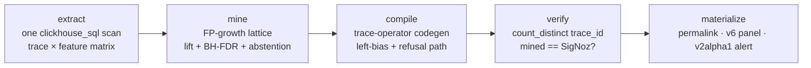

# Whodunit

**Deterministic structural root-cause analysis whose output is a SigNoz query you own.**

<!-- Badges: CI wired in .github/workflows; placeholders until the repo is public. -->


Point Whodunit at a set of failing traces. It auto-selects a case-control–matched
healthy cohort, mines the full itemset lattice for the span / edge / log patterns
that structurally separate the two, and **compiles the winning finding into a valid
SigNoz `builder_trace_operator` query** — then verifies that query against the live
engine and reports precision/recall. The deliverable is never a paragraph: it is a
Query Builder artifact you own — a Trace Explorer permalink, a dashboard panel, and
an armed alert. There is **no LLM anywhere in the runtime**.

> **Everyone can show you the difference. Only SigNoz can arm it.**

Every other tool in this category (Honeycomb BubbleUp, Datadog Trace Patterns,
Chronosphere DDx, Grafana `compare()`) stops at a ranking a human then re-types by
hand. Whodunit closes the loop: mine → compile → verify → arm. It is the
implementation of [SigNoz/signoz#1957](https://github.com/SigNoz/signoz/issues/1957)
("Enable a way to compare 2 sets of filtered spans"), opened by co-founder pranay01
in January 2023 and still open — answered with an artifact rather than a panel.

---

## 30-second quickstart

Three commands, from an empty machine to a verified verdict:

```bash
# 1. Stand up SigNoz + its MCP server via Foundry (installs the whole stack).
foundryctl cast -f deploy/casting.yaml

# 2. Generate a disclosed, deterministic demo corpus with a seeded structural fault.
#    ~800 traces of an 8-service "shop", one conjunctive fault, ground-truth manifest.
python -m corpus.generate --traces 800 --seed 101 \
    --fault conditional_dep --fault-rate 0.11 \
    --endpoint http://localhost:4318

# 3. Explain the fault: extract -> mine -> compile -> verify, all against live SigNoz.
export SIGNOZ_URL=http://localhost:8080
export SIGNOZ_EMAIL=... SIGNOZ_PASSWORD=... SIGNOZ_ORG_ID=...
whodunit explain --from-manifest corpus/out/manifest-<runid>.json
```

Add `--arm` to turn the compiled discriminator into a live v2alpha1 alert, or
`--dashboard` to emit a native v6 panel. `--json` prints the full machine-readable
result including the verdict hash.

> The live stack on this machine already occupies `:8080`/`:4318`, so `casting.yaml`
> is set up for `foundryctl forge` (file generation) during development; run `cast`
> on a clean host or VM. See [`docs/DEMO-RUNBOOK.md`](docs/DEMO-RUNBOOK.md) for the
> pristine-corpus preparation steps.

## Sample output — the elimination board

`whodunit explain` shows its work. The machine considers the obvious single-predicate
answers, eliminates them, and keeps only the conjunction that actually separates the
cohorts (from the `conditional_dep` scenario, seed 101):

```
                          THE ELIMINATION BOARD
  candidate                                        lift    95% CI    bad  healthy  verdict
> edge payment=>redis-retry AND NOT flag-service   9.0x  [8.1, 9.0]   89        0  DISCRIMINATOR
  ------------------------------------------------------------------------------------------
x edge payment=>redis-retry                        1.4x  [1.2, 1.7]   89      541  near-miss
x NOT span flag-service                            1.9x  [1.6, 2.2]   72      219  near-miss
  7806 candidate itemsets enumerated | 36 features | 1 survivor

Winner survives on lift 9.0x where every single-predicate near-miss above was
eliminated — that is the conjunction earning its keep.

compiled trace-operator query (yours to keep)
  (A => B) && NOT C          returnSpansFrom = A
  A : service.name = 'shop-payment'
  B : name = 'redis-retry'
  C : service.name = 'shop-flag-service'

verification receipt (differential)
  mined 89  |  SigNoz 89  |  MATCH  |  recall 1.00  |  162,057 rows scanned

verdict hash  a1c4…  (deterministic: re-run lands the identical hash)
```

The winner and its verification counts (`mined 89 | SigNoz 89 | MATCH`) are the real
`conditional_dep` benchmark result ([`benchmark/REPORT.md`](benchmark/REPORT.md)); the
near-miss healthy counts in the board above are representative of the single-predicate
regime the miner rejects.

## Architecture



- **extract** — one `clickhouse_sql` v5 query builds a per-`trace_id` boolean matrix:
  span predicates (latency bucketed from raw `duration_nano`), parent→child edges
  (self-join on `parent_span_id`), depth-bounded ancestor walks, and log features
  joined by `trace_id` from the **same** ClickHouse. A case-control matcher selects
  the healthy cohort so the discriminator cannot be the selection axis.
  ([`src/whodunit/extract/SCHEMA-NOTES.md`](src/whodunit/extract/SCHEMA-NOTES.md))
- **mine** — FP-growth enumerates the complete itemset lattice (a `NOT` feature is a
  complement column) *before* any test runs, so Benjamini–Hochberg FDR control is
  valid. Ranking is by lift with population support and bootstrap CIs, gated on
  effect size before significance. Abstention is a first-class calibrated outcome.
- **compile** — the crown jewel: a normaliser + emitter that turns the winning
  itemset into a valid `builder_trace_operator` envelope, respecting constraints
  recovered by probing the live engine (below).
  ([`src/whodunit/compile/ENGINE-NOTES.md`](src/whodunit/compile/ENGINE-NOTES.md))
- **verify** — every compiled expression is run against `/api/v5/query_range` as a
  scalar `count_distinct(trace_id)` and asserted equal to the count the miner
  computed locally. Mismatches are reported, never hidden.
- **materialize** — Trace Explorer permalink, native v6 dashboard panel, and a
  v2alpha1 multi-threshold alert whose webhook fires end-to-end.
  ([`src/whodunit/materialize/NOTES.md`](src/whodunit/materialize/NOTES.md))

### The verification receipt

The receipt is the honesty mechanism. Whodunit mines a finding locally, then asks
SigNoz the compiled query and compares:

```
candidate   (A => B) && NOT C
mined       89 traces        (local FP-growth over the feature matrix)
SigNoz      89 traces        ✓ MATCH   (count_distinct(trace_id) via /api/v5/query_range)
recall 1.00                  162,057 rows scanned
```

A match means the synthesised query means what the miner thought it meant. A mismatch
is where engine semantics get discovered and documented — every one of the four
engine findings below was first surfaced as a receipt mismatch.

## Benchmark summary

Six scenarios — two expressible faults, one trace-scoped absence, and three where the
honest answer is to abstain — each run live against the stack, scored against a
machine-checkable ground-truth manifest, with a properly-implemented BubbleUp-style
flat baseline for comparison ([`benchmark/REPORT.md`](benchmark/REPORT.md)):

| scenario | ground truth | whodunit | recall | flat baseline | where the baseline wins |
|---|---|---|:--:|---|---|
| `conditional_dep` | discriminator | **discriminator** ✓ | 1.00 | **fails** (0.23/1.00) | — |
| `new_edge` | discriminator | **discriminator** ✓ | 1.00 | ties (1.00/1.00) | single-feature fault |
| `cache_bypass` | discriminator | **discriminator** ✓ | 1.00 | ties (1.00/1.00) | single-feature absence |
| `retry_storm` | abstain | **partial** ✓ | — | fails (0.21/0.99) | — (cardinality, inexpressible) |
| `decoys` | abstain | **abstain** ✓ | — | fails (0.29/0.85) | — (no false culprit) |
| `null_scenario` | abstain | **abstain** ✓ | — | fails (0.14/0.77) | — (nothing is wrong) |

**6/6 pass.** Whodunit nails the flagship conjunction the flat baseline cannot see,
ties on the single-feature faults, and takes the honesty path — calibrated
abstain/partial, never a false culprit — on the three where a confident answer would
be wrong. It is honest about where the flat baseline performs equally well
(`new_edge`, `cache_bypass` — its home turf of single-feature faults).

> `cache_bypass` originally scored as a miss (ABSTAIN): the pure-absence
> discriminator (`NOT cache-get`) is soundly refused by the compiler (no positive
> operand to return spans from), and the miner's MDL prune dropped the compilable
> positive-anchored superset at a tied CI floor. The fix recovers the best
> *compilable* candidate from the miner's near-misses at a tied lift-CI floor
> (`benchmark/ISSUES.md` #2, original finding preserved). Re-run (seed 203):
> compiled `(A => B) && NOT (C => D)`, label recall/precision 1.0, differential
> verification 160/160.

## Documented limitations

- **Repetition / N+1 faults are inexpressible.** The `builder_trace_operator` algebra
  has no per-trace cardinality qualifier, so a fault like "2–5 redis-retry siblings vs
  1" (`retry_storm`) cannot be a presence/absence discriminator. Whodunit abstains or
  returns a below-confidence PARTIAL rather than fabricating a culprit, and we ship an
  **upstream proposal** for a cardinality qualifier: `A =>{n>10} B`.
- **Pure-absence discriminators need a positive anchor.** A bare `NOT C` returns zero
  spans (there is nothing to return spans *from*), so absence is only expressible as a
  conjunct `A && NOT C` with an always-present anchor `A`. Absence-only itemsets are
  **refused, loudly** ([`benchmark/ISSUES.md`](benchmark/ISSUES.md) #2).
- **`clickhouse_sql` ignores the envelope time window (platform finding).** A 3-minute
  window and a 1-year window return byte-identical rows; the SQL must carry its own
  time predicate. The benchmark scopes by explicit trace-id sets as a result
  ([`benchmark/ISSUES.md`](benchmark/ISSUES.md) #1).
- **Synthetic, disclosed corpus.** All demo traffic is generated and labelled by
  `corpus.generate`; ground truth comes from the manifest, not human judgement. This
  is a methodology strength (exact labels) and a caveat (no real-world messiness
  beyond the injected decoys). Hidden synthetic data is fatal; disclosed synthetic
  data is standard fault-injection methodology.

## What we found in the engine

Four semantics of the trace-operator engine are undocumented or misdocumented. Each
was recovered by probing the live v0.132.2 stack and is load-bearing for the compiler
([`Track2/probe-results/PROBES.md`](../probe-results/PROBES.md),
[`src/whodunit/compile/ENGINE-NOTES.md`](src/whodunit/compile/ENGINE-NOTES.md)):

1. **Operator mapping is the reverse of what the ecosystem assumes.** On v0.132.2,
   `=>` is the **direct** (single-hop) descendant operator and `->` is the
   **indirect** (any-depth) operator — the opposite of the intuitive reading.
   `rootWrap => childOp` (2 hops) returns **0**; `rootWrap -> childOp` returns **20**.
   Emit the wrong token and every multi-level discriminator silently returns nothing.
   *Upstream: a documentation PR for the operator mapping.*
2. **Operator alert deep links are built from a leaf filter, not the operator.**
   `prepareParamsForTraces` does not type-switch on the trace operator, so a fired
   alert's "view related traces" link points at one leaf query's filter (in our case
   the `NOT` operand — the most misleading possible choice). *Upstream: a one-case fix
   to `prepareParamsForTraces`; Whodunit ships its own correct permalink meanwhile.*
3. **`NOT` is trace-scoped, and a bare `NOT C` returns zero.** `NOT` lowers to
   `GLOBAL NOT IN (SELECT trace_id …)`, so "this trace contains no C anywhere"
   compiles soundly, but "this span is not accompanied by C" does not and is refused.
   A bare `NOT C` yields an empty span set (nothing to return from). *Upstream: a
   documentation PR for `NOT`'s trace-scoped semantics.*
4. **`clickhouse_sql` does not apply the envelope time window** (finding #3 above,
   restated as an engine fact). *Filed as an upstream issue.*

## Development

```bash
uv venv && uv pip install -e ".[dev]"
just lint    # ruff
just type    # mypy (strict, src only)
just test    # pytest
# (or the make equivalents: make lint type test)
```

## AI disclosure

This project was developed with AI assistance. Claude (Fable 5 and Opus 4.8, via
Claude Code) was used for research, repository scaffolding, and code generation, with
human review of all output. This disclosure is required by the hackathon rules. AI is
used only during **development** — there is **no LLM anywhere in Whodunit's runtime**.
The product is a deterministic Query Builder synthesis engine; the same input plus
seed always produces the same verdict hash.

## License

MIT. See [`LICENSE`](LICENSE).

---

Built for the **Agents of SigNoz** hackathon, **Track 2 — Signals & Dashboards**.
