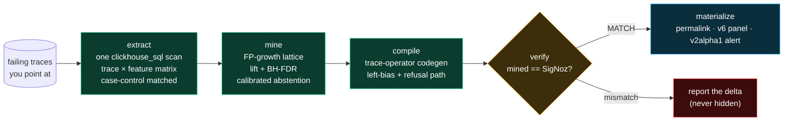
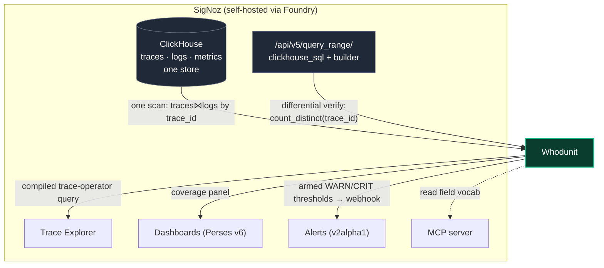

# Whodunit

**Deterministic structural root-cause analysis whose output is a SigNoz query you own.**

> *Everyone can show you the difference between two sets of traces. Only SigNoz can arm it.*


<sub>**Real run (seed 778):** 7,806 candidate itemsets enumerated in one scan → the conjunction `(payment ⇒ redis-retry) ∧ ¬ flag-service` survives at **13.1× lift** → compiled to `(A ⇒ B) && NOT C` → **mined 61, SigNoz returned 61, MATCH**. No LLM in the runtime.</sub>

<!-- Badges: CI wired in .github/workflows; the ci badge goes live when the repo is public. -->


---

Point Whodunit at a set of failing traces. It auto-selects a case-control–matched
healthy cohort, mines the full itemset lattice for the span / edge / log patterns that
structurally separate the two, and **compiles the winning finding into a valid SigNoz
`builder_trace_operator` query** — then verifies that query against the live engine and
reports precision/recall. The deliverable is never a paragraph: it is a Query Builder
artifact you own — a Trace Explorer permalink, a dashboard panel, and an armed alert.

**There is no LLM anywhere in the runtime.** The same input plus seed always produces
the same verdict hash.

### Contents

- [Why it exists](#why-it-exists)
- [How it works](#how-it-works) — the pipeline
- [How it uses SigNoz](#how-it-uses-signoz) — all five surfaces
- [30-second quickstart](#30-second-quickstart)
- [Sample output](#sample-output--the-elimination-board)
- [Benchmark](#benchmark)
- [What we found in the engine](#what-we-found-in-the-engine)
- [Limitations](#documented-limitations)
- [Development](#development) · [AI disclosure](#ai-disclosure) · [License](#license)

---

## Why it exists

The "compare two cohorts of spans" problem is well-trodden — and every product stops
at the same place: a ranking a human then re-types into a query by hand.

| Tool | What it does | Where it stops |
|---|---|---|
| Honeycomb BubbleUp | ranks flat attribute distributions | flat only; no structure; no query out |
| Datadog Trace Patterns | groups spans by structure | 1% sample, excluded from monitor eval |
| Chronosphere DDx / Lightstep | baseline-vs-deviation attribution | closed source; verdict panel only |
| Grafana Traces Drilldown `compare()` | selection vs baseline attributes | ranks attributes; no alertable artifact |

**Everyone can show you the difference. Nobody hands you the query.** Whodunit closes
the loop — mine → compile → verify → arm — and it is the implementation of
[SigNoz/signoz#1957](https://github.com/SigNoz/signoz/issues/1957) *("Enable a way to
compare 2 sets of filtered spans")*, opened by co-founder **pranay01 in January 2023**
and still open three and a half years later. Answered with an artifact, not a panel.

## How it works

Five stages. No LLM in any of them.



- **extract** — one `clickhouse_sql` v5 query builds a per-`trace_id` boolean matrix:
  span predicates (latency bucketed from raw `duration_nano`), parent→child edges
  (self-join on `parent_span_id`), depth-bounded ancestor walks, and log features
  joined by `trace_id` from the **same** ClickHouse. The case-control matcher selects
  the healthy cohort on the axis the selection was made along, so the discriminator can
  never just *be* the selection axis.
  ([`extract/SCHEMA-NOTES.md`](src/whodunit/extract/SCHEMA-NOTES.md))
- **mine** — FP-growth enumerates the complete itemset lattice (a `NOT` feature is a
  complement column) **before** any test runs, so Benjamini–Hochberg FDR control is
  valid rather than post-selection inference. Ranking is by lift with bootstrap CIs,
  gated on effect size. Abstention is a first-class, calibrated outcome.
- **compile** — the crown jewel: a normaliser + emitter that turns the winning itemset
  into a valid `builder_trace_operator` envelope, respecting engine constraints that are
  undocumented and were recovered by probing.
  ([`compile/ENGINE-NOTES.md`](src/whodunit/compile/ENGINE-NOTES.md))
- **verify** — the compiled expression runs against `/api/v5/query_range` as a scalar
  `count_distinct(trace_id)`, asserted equal to the miner's local count.
- **materialize** — Trace Explorer permalink, native v6 dashboard panel, and a v2alpha1
  multi-threshold alert whose webhook fires end-to-end.
  ([`materialize/NOTES.md`](src/whodunit/materialize/NOTES.md))

## How it uses SigNoz

Whodunit is not a tool that merely *sends data to* SigNoz — it reads from, computes
against, and writes back into **all five signal surfaces**, and installs via Foundry.



| Surface | How Whodunit uses it |
|---|---|
| **Traces** | The per-trace feature matrix (span predicates, `parent_span_id` edges, ancestor walks) is built in one `clickhouse_sql` scan. |
| **Logs** | Log features are joined by `trace_id` in the **same** ClickHouse scan — a cross-signal join that is physically impossible on Tempo+Loki (separate stores). |
| **Query Builder** | The compiled output is a first-class `builder_trace_operator` expression, verified via `/api/v5/query_range`. |
| **Dashboards** | The discriminator is emitted as a native Perses **v6** panel trending its share of traffic. |
| **Alerts** | The discriminator is armed as a **v2alpha1** rule with WARN/CRIT named thresholds; a fired webhook was caught end-to-end at **t+182s**. |
| **Foundry** | `deploy/casting.yaml` (+ `.lock`) stands up SigNoz **and** the MCP server in one command. |

## 30-second quickstart

Three commands, from an empty machine to a verified verdict:

```bash
# 1. Stand up SigNoz + its MCP server via Foundry (installs the whole stack).
foundryctl cast -f deploy/casting.yaml

# 2. Generate a disclosed, deterministic demo corpus with a seeded structural fault.
#    ~800 traces of an 8-service "shop", one conjunctive fault, ground-truth manifest.
python -m corpus.generate --traces 800 --seed 778 \
    --fault conditional_dep --fault-rate 0.11 \
    --endpoint http://localhost:4318

# 3. Explain the fault: extract -> mine -> compile -> verify, all against live SigNoz.
export SIGNOZ_URL=http://localhost:8080
export SIGNOZ_EMAIL=... SIGNOZ_PASSWORD=... SIGNOZ_ORG_ID=...
whodunit explain --from-manifest corpus/out/manifest-<runid>.json
```

Add `--arm` to turn the compiled discriminator into a live v2alpha1 alert, `--dashboard`
to emit a native v6 panel, or `--json` for the full machine-readable result including
the verdict hash.

> The live stack on this machine already occupies `:8080`/`:4318`, so `casting.yaml` is
> used with `foundryctl forge` (file generation) during development; run `cast` on a
> clean host or VM. See [`docs/DEMO-RUNBOOK.md`](docs/DEMO-RUNBOOK.md) for the
> pristine-corpus preparation steps.

## Sample output — the elimination board

`whodunit explain` shows its work. It considers the obvious single-predicate answers,
eliminates them, and keeps only the conjunction that actually separates the cohorts
(the `conditional_dep` scenario, **seed 778** — the run in the GIF above):

```
                          whodunit | verdict
  DISCRIMINATOR
  The culprit is WITH edge payment=>redis-retry AND WITHOUT flag-service  (lift 13.1x)

                          THE ELIMINATION BOARD
    candidate                                        lift    95% CI      bad  healthy  verdict
  > edge payment=>redis-retry AND NOT flag-service   13.1x  [10.8, 17.2]  61       0   discriminator
    ...single-predicate near-misses struck out: each appears in BOTH cohorts...
    7806 candidate itemsets enumerated | 36 features | 6 survivors

  compiled trace-operator query (yours to keep)
    (A => B) && NOT C          returnSpansFrom = A
    A : service.name = 'shop-payment'
    B : name = 'redis-retry'
    C : service.name = 'shop-flag-service' AND name = 'GET /flags/evaluate'

  verification receipt (differential)
    mined 61  |  SigNoz 61  |  MATCH  |  precision 1.00  |  recall 1.00
    cost meter: one scan, 163,464 rows, 1,843 ms

  verdict hash  95f8835…   (deterministic: re-run lands the identical hash)
```

The flat baseline — a properly-implemented BubbleUp-style z-test over every single
feature — runs on the *same* matrix and returns `NOT edge__shop_checkout__GET_flags_evaluate`
at precision **0.17**. It cannot see the conjunction, because no single predicate
separates the cohorts. That is the whole thesis in one number.

> **A note on seeds.** Headline figures above are the **seed-778** demo run (shown in
> the GIF). The [benchmark](#benchmark) below aggregates six scenarios at their own
> `REPORT.md` seeds (e.g. `conditional_dep` at seed 101 → 89 bad traces, baseline
> 0.23). Exact counts vary with seed and fault-rate; the invariants do not — recall
> stays 1.00 and the flat baseline stays far below the 0.80 precision gate.

## Benchmark

Six scenarios — two expressible faults, one trace-scoped absence, and three where the
honest answer is to abstain — each run live against the stack, scored against a
machine-checkable ground-truth manifest, with a properly-implemented BubbleUp-style
flat baseline for comparison ([`benchmark/REPORT.md`](benchmark/REPORT.md)):

| scenario | ground truth | whodunit | recall | flat baseline | where the baseline wins |
|---|---|---|:--:|---|---|
| `conditional_dep` | discriminator | **discriminator** ✓ | 1.00 | **fails** (0.23/1.00) | — |
| `new_edge` | discriminator | **discriminator** ✓ | 1.00 | ties (1.00/1.00) | single-feature fault |
| `cache_bypass` | discriminator | **discriminator** ✓ | 1.00 | ties (1.00/1.00) | single-feature absence |
| `retry_storm` | abstain | **partial** ✓ | — | fails (0.21/0.99) | — (cardinality, inexpressible) |
| `decoys` | abstain | **abstain** ✓ | — | fails (0.29/0.85) | — (no false culprit) |
| `null_scenario` | abstain | **abstain** ✓ | — | fails (0.14/0.77) | — (nothing is wrong) |

**6/6 pass.** Whodunit nails the flagship conjunction the flat baseline cannot see,
ties on the single-feature faults (their home turf — reported honestly), and takes the
honesty path — calibrated abstain/partial, never a false culprit — on the three where a
confident answer would be wrong.

> `cache_bypass` originally scored as a **miss** (ABSTAIN): the pure-absence
> discriminator (`NOT cache-get`) is soundly refused by the compiler (no positive
> operand to return spans from), and the miner's MDL prune dropped the compilable
> anchored superset at a tied CI floor. The fix recovers the best *compilable*
> candidate from the miner's near-misses at a tied lift-CI floor — original failure
> preserved in [`benchmark/ISSUES.md`](benchmark/ISSUES.md) #2. Re-run: compiled
> `(A => B) && NOT (C => D)`, recall/precision 1.0, verification 160/160. **Finding a
> seam like this, then fixing it in the open, is exactly what this project is for.**

## What we found in the engine

Four semantics of the trace-operator engine are undocumented or misdocumented. Each was
recovered by probing the live v0.132.2 stack, is load-bearing for the compiler, and is
headed upstream ([`probe-results/PROBES.md`](../probe-results/PROBES.md),
[`compile/ENGINE-NOTES.md`](src/whodunit/compile/ENGINE-NOTES.md)):

1. **Operator mapping is the reverse of the intuitive reading.** On v0.132.2, `=>` is
   the **direct** (single-hop) descendant and `->` is the **indirect** (any-depth) one.
   `rootWrap => childOp` (2 hops) returns **0**; `rootWrap -> childOp` returns **20**.
   Emit the wrong token and every multi-level discriminator silently returns nothing.
2. **Operator alert deep links are built from a leaf filter, not the operator.**
   `prepareParamsForTraces` doesn't type-switch on the trace operator, so a fired
   alert's "view related traces" link points at one leaf's filter (in our case the
   `NOT` operand — the most misleading choice). Whodunit ships its own correct permalink.
3. **`NOT` is trace-scoped, and a bare `NOT C` returns zero.** It lowers to
   `GLOBAL NOT IN (SELECT trace_id …)`, so "this trace contains no C" compiles soundly,
   but "this span is not accompanied by C" does not and is **refused**.
4. **`clickhouse_sql` does not apply the envelope time window.** A 3-minute window and a
   1-year window return byte-identical rows; the SQL must carry its own time predicate.

## Documented limitations

- **Repetition / N+1 faults are inexpressible.** The algebra has no per-trace cardinality
  qualifier, so "2–5 redis-retry siblings vs 1" (`retry_storm`) can't be a presence
  discriminator. Whodunit abstains rather than fabricating a culprit, and ships an
  upstream proposal: `A =>{n>10} B`.
- **Pure-absence discriminators need a positive anchor** — absence is only expressible
  as `A && NOT C`. Absence-only itemsets are refused, loudly.
- **Synthetic, disclosed corpus.** All demo traffic is generated and labelled by
  `corpus.generate`; ground truth comes from the manifest, not human judgement — a
  methodology strength (exact labels) and a caveat (no real-world messiness beyond the
  injected decoys). Hidden synthetic data is fatal; disclosed is standard fault-injection.

## Development

```bash
uv venv && uv pip install -e ".[dev]"
just lint    # ruff
just type    # mypy (strict, src only)
just test    # pytest  — 131 passing
```

## AI disclosure

This project was developed with AI assistance. Claude (via Claude Code) was used for
research, repository scaffolding, and code generation, with human review of all output.
This disclosure is required by the hackathon rules. AI is used **only during
development** — there is **no LLM anywhere in Whodunit's runtime**. The product is a
deterministic Query Builder synthesis engine; the same input plus seed always produces
the same verdict hash.

## License

MIT. See [`LICENSE`](LICENSE).

---

Built for the **Agents of SigNoz** hackathon, **Track 2 — Signals & Dashboards**.
