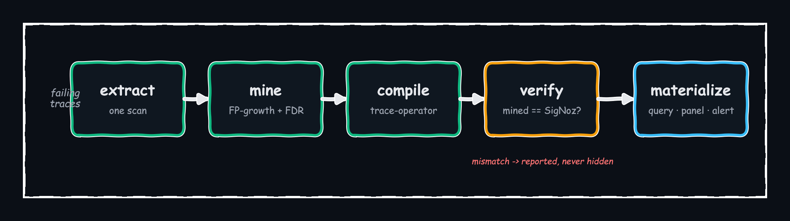
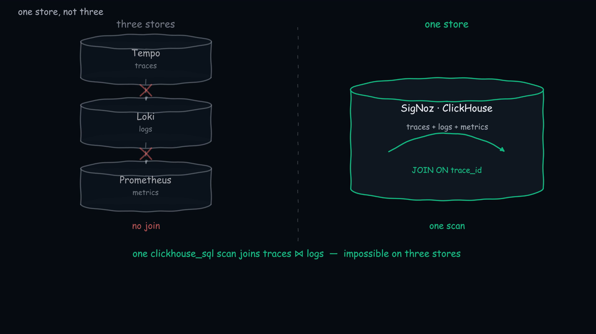
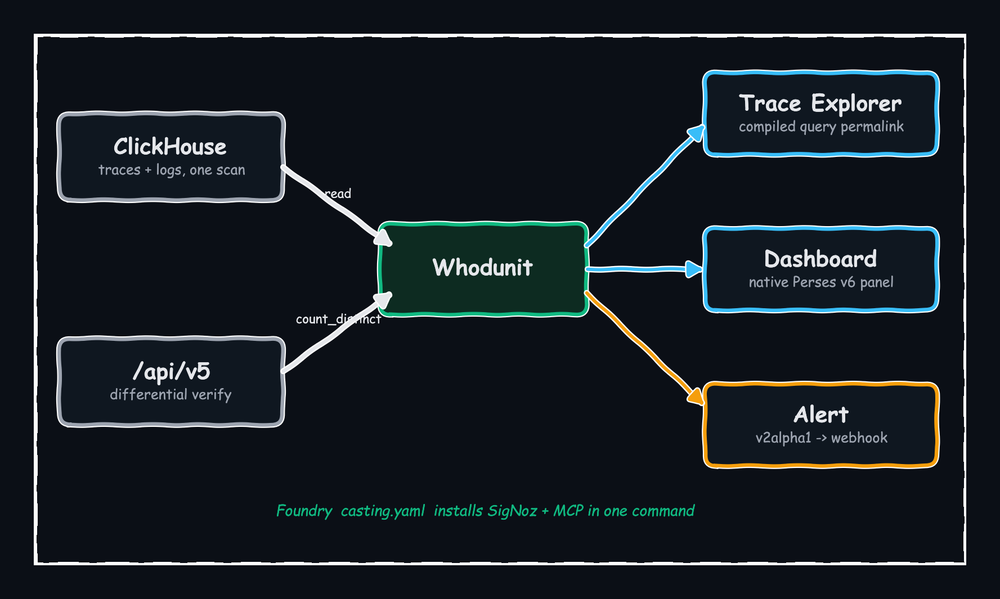
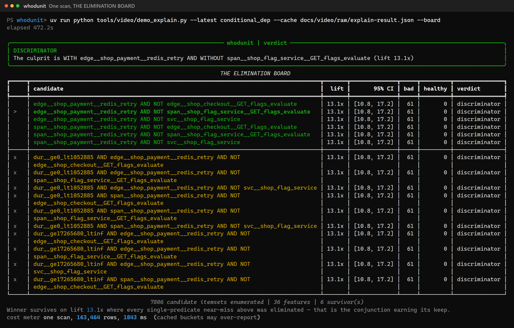
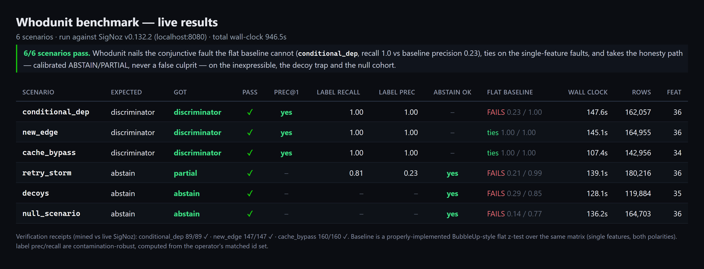
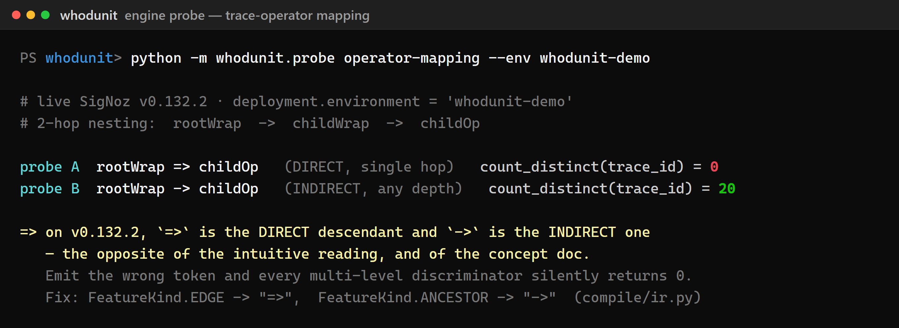
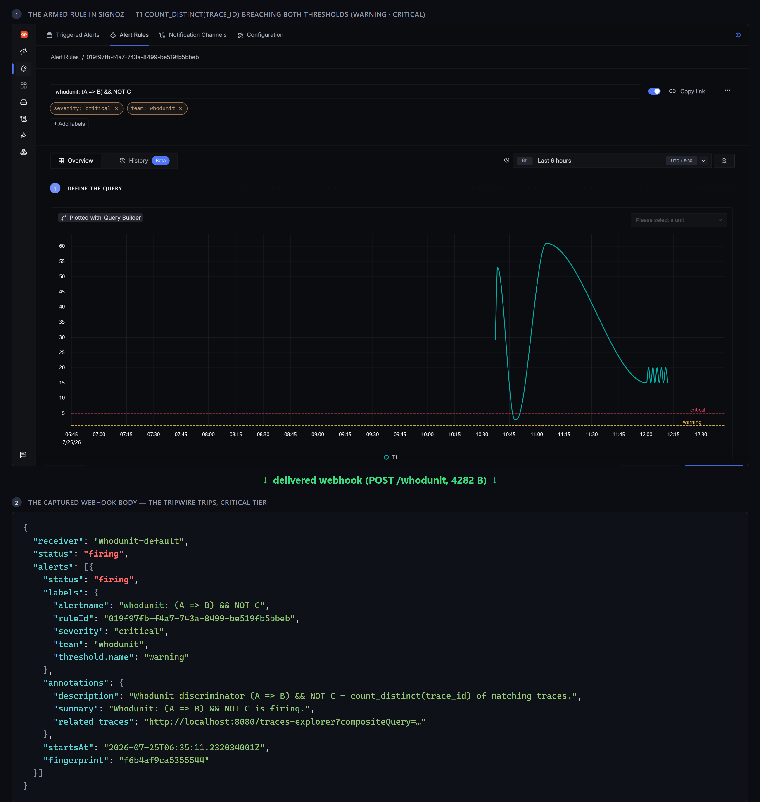

<!--
PUBLISHING NOTES
- Screenshots use RELATIVE paths (blog/images/*.png) so they render in GitHub's preview
  whether the repo is public or private.
- When pasting into Medium / Dev.to / Hashnode: use the editor's image upload and drag
  the matching PNG from docs/blog/images/. Every PNG is >=2560px wide
  (deviceScaleFactor=2) so it stays retina-sharp on Medium's ~1400px column. Do NOT
  screenshot-of-a-screenshot.
- Fill in the [VIDEO] placeholder below once the YouTube link exists.
-->

# Whodunit: compiling a root-cause finding back into a SigNoz query you own

> Draft for the hackathon submission blog. Target platform: Dev.to / Hashnode.
> Publish publicly.

**Title options (none overclaim):**
1. *Whodunit: compiling a root-cause finding back into a SigNoz query you own*
2. *Everyone shows you the difference. I taught the machine to hand you the query.*
3. *Mining, compiling, and verifying a trace-operator query against live SigNoz*

---

**Built for the [Agents of SigNoz](https://www.wemakedevs.org/hackathons/signoz) hackathon — Track 2, Signals & Dashboards.**

- 💻 **Code:** [github.com/wiz-abhi/WhodUnit](https://github.com/wiz-abhi/WhodUnit)
- ▶️ **Try it live (no install):** [wiz-abhi-whodunit-replay.static.hf.space](https://wiz-abhi-whodunit-replay.static.hf.space) — step through the real recorded run in your browser
- 🎬 **Demo video:** `[VIDEO — add YouTube link]`

---

## The cold open

In January 2023, SigNoz's co-founder opened
[issue #1957](https://github.com/SigNoz/signoz/issues/1957): *"Enable a way to compare
2 sets of filtered spans."* Baseline vs regression, deployment versions, time-period
comparison. Its sibling #1956 ("compare 2 traces") went up the same day. Both are
still open. Three and a half years later, SigNoz's own `signoz-investigating-alerts`
agent skill still lists, under *out of scope (v1)*, "cross-service blast-radius
walking."

I want to be precise about what that issue is and isn't. It has zero reactions — this
is not a story about overwhelming community demand. It's a story about *authorship and
longevity*: the person who built the product asked for a specific capability, and the
gap has stood open for three and a half years while the whole industry shipped
half-answers around it. That gap is the shape of Whodunit.

## What everybody already ships — and where they stop

The "compare two cohorts of spans" problem is well-trodden. What's striking is how
uniformly every product stops at the same place:


*Every one of them ends at the same wall: a ranking a human then re-types by hand.*

| Product | What it does | Where it stops |
|---|---|---|
| Honeycomb BubbleUp | ranks flat attribute distributions, selection vs baseline | flat only; no structure; no executable output |
| Datadog Trace Patterns | groups spans by structure into recurring patterns | runs on a 1% sample, excluded from monitor evaluation |
| Datadog APM Recommendations | zero-config N+1 / retry detection | a recommendation card, not a query |
| Chronosphere DDx, Lightstep Change Intelligence | baseline-vs-deviation attribution | closed source; verdict panel only |
| Grafana Traces Drilldown `compare()` | selection vs baseline attribute differences | ranks attributes; no alertable artifact |
| TraceContrast (ICSE 2024) | contrast sequential pattern mining | a paper; offline; no emitted query |

Every one of them ends the same way: a human reads a ranking, then goes and writes the
query by hand. **Everyone can show you the difference. Nobody hands you the query.**
That is the sentence the whole project is built to earn. Not "no prior art" — a
Datadog-literate reader would kill that in ten seconds, because Datadog Trace Queries
use the *identical* operator set (`=>`, `->`, `&&`, `||`, `NOT`). The novel part isn't
the operators. It's that nobody has ever *compiled a mined finding back into that
grammar, verified it against the live engine, and armed it as a standing alert.*

## The pipeline

Whodunit is five stages, and there is no LLM in any of them. The same input plus seed
always yields the same verdict hash.

```
extract → mine → compile → verify → materialize
```



*The five stages. `verify` is the one that makes the rest trustworthy: a mismatch is reported, never hidden.*

**Extract.** One `clickhouse_sql` scan builds a per-`trace_id` boolean feature matrix:
span predicates (latency bucketed from raw `duration_nano`, *not* the coarse
18-boundary `signoz_latency.bucket`), parent→child edges via a self-join on
`parent_span_id`, depth-bounded ancestor walks, and — the cross-signal move — log
features joined by `trace_id` from the **same** ClickHouse. That last join is the thing
that is physically impossible on Tempo+Loki (separate stores) and on Datadog (no raw
store). A case-control matcher picks the healthy cohort matched on the axis the
selection was made along, so the discriminator can never just be the selection axis —
the failure mode that makes "duration > X" separate perfectly and explain nothing.



*Why this has to be SigNoz: traces and logs sit in one ClickHouse, so a single scan joins them on `trace_id`. On a Tempo + Loki + Prometheus stack that join doesn't exist to make.*

**Mine.** FP-growth enumerates the *complete* itemset lattice — singles, conjunctions,
and absences (a `NOT` feature is a complement column) — **before** any statistical test
runs. That ordering matters: it makes Benjamini–Hochberg FDR control valid instead of
textbook post-selection inference. Ranking is by lift with population support and
bootstrap confidence intervals, gated on effect size before significance. And
abstention is a first-class, calibrated outcome: if nothing clears the gates, Whodunit
says so rather than inventing a culprit.

**Compile.** This is the crown jewel and the actual hard problem: generate a *valid*
`builder_trace_operator` request from the winning itemset. The grammar has constraints
that are nowhere documented and that I recovered by reading the generator and probing
the live engine — right-to-left precedence, left-biased result sets, a `≤10` operator
cap, leaf queries referenced by name (never inline filters). More on the surprises
below.

**Verify.** Every compiled expression is run against `/api/v5/query_range` as a scalar
`count_distinct(trace_id)` and asserted equal to the count the miner computed locally.

**Materialize.** Trace Explorer permalink, native v6 dashboard panel, armed v2alpha1
alert.



*All five surfaces, in one loop — read from ClickHouse and `/api/v5`, write back a query, a panel, and a tripwire. Foundry's `casting.yaml` stands the whole stack up, MCP server included, in one command.*

## The real numbers

Here is the flagship `conditional_dep` scenario end to end. The seeded fault is
`(shop-payment => redis-retry) && NOT shop-flag-service`: bad traces retry Redis while
the feature-flag service is unreachable. It's engineered so *healthy traffic never
contains the conjunction* — every single predicate appears in **both** cohorts.


*The fault, drawn — and why it's hard. Ring the retry: it's in healthy traces too. Ring the missing flag-service: also in healthy traces. Neither condition alone separates the cohorts. Only both at once, which is exactly the regime a flat attribute ranking cannot reach.*

```
7,806 candidate itemsets enumerated  →  36 features
  edge payment=>redis-retry        present in both cohorts — near-miss, struck out
  NOT flag-service                 present in both cohorts — near-miss, struck out
  (payment=>redis-retry) && NOT flag-service   lift 13.1x   ← SURVIVES

compiled:  (A => B) && NOT C   returnSpansFrom = A
mined      61 traces
SigNoz     61 traces   ✓ MATCH   recall 1.00   163,464 rows scanned
```



*The elimination board from a live `whodunit explain --board` run: 7,806 candidate itemsets enumerated, and the conjunction `edge__shop_payment__redis_retry AND NOT shop-flag-service` is the only survivor — lift 13.1x, 61 bad traces, 0 healthy. Every single-predicate near-miss above it was struck out.*

The flat baseline — a properly-implemented BubbleUp-style z-test over every single
feature, not a strawman — runs on the *same* matrix and returns
`NOT edge__shop_checkout__GET_flags_evaluate` at precision **0.17**, recall 1.00. It
cannot see the conjunction because no single predicate separates the cohorts. This is
the whole thesis in one number: the fault requires two conditions at once, and that is
exactly the regime flat tools miss.

Across all six benchmark scenarios (two expressible faults, one trace-scoped absence,
three abstain-cases), Whodunit now passes 6/6 — but the most useful row is the one it
initially *lost*, because a benchmark that only reports wins isn't a benchmark:

| scenario | ground truth | whodunit | flat baseline |
|---|---|---|---|
| `conditional_dep` | discriminator | **discriminator** ✓ | fails (0.23/1.00) |
| `new_edge` | discriminator | **discriminator** ✓ | ties (1.00/1.00) |
| `cache_bypass` | discriminator | **discriminator** ✓ | ties (1.00/1.00) |
| `retry_storm` | abstain | **partial** ✓ | fails |
| `decoys` | abstain | **abstain** ✓ | fails |
| `null_scenario` | abstain | **abstain** ✓ | fails |

On `new_edge` and `cache_bypass` (single-feature faults) the flat baseline *ties* —
those are its home turf, they don't need conjunction mining, and I say so. And
`cache_bypass` initially scored as a loss: the pure trace-scoped absence
(`NOT cache-get`) is soundly refused by the compiler (bare `NOT` has no positive
operand to return spans from — the engine returns zero traces for it, a documented
conformance finding), while the miner's parsimony prune dropped the compilable
anchored superset at a tied confidence floor. The fix wasn't to weaken either
engine — it was to let the pipeline recover the best *compilable* candidate from the
miner's own near-misses at a tied lift-CI floor. Re-run: compiled
`(A => B) && NOT (C => D)`, label recall and precision 1.0, differential verification
160/160. The original failing result is preserved in `benchmark/ISSUES.md` #2,
because finding that seam is exactly the kind of thing this project exists to surface.



*The aggregate table rendered from `benchmark/REPORT.md`: 6/6 pass, each row showing Whodunit's verdict against the flat baseline's precision/recall on the same matrix.*

## The refusal path is a feature

On the three abstain-scenarios, a confident answer would be a *failure*. `decoys` seeds
an attribute (`tenant.tier=gold`) that correlates ~85% with the bad label but does not
cause it; Whodunit abstains and surfaces the refusal reason instead of naming the
decoy. `retry_storm` is a per-trace cardinality regression (2–5 Redis retries vs 1) —
*inexpressible* in a presence/absence algebra — and Whodunit returns a below-confidence
PARTIAL on a latency symptom rather than a fabricated culprit. `null_scenario` has
nothing wrong at all, and abstaining is the only correct answer. A tool that always
finds something is a tool you can't trust at 3am.

## The engine archaeology

Building the compiler meant getting four `builder_trace_operator` semantics exactly
right — some SigNoz already documents, some I learned the hard way. Every one first
surfaced as a *verification receipt mismatch*, which is precisely what the receipt is
for:

1. **Operator direction and left-bias.** SigNoz documents — in
   [issue #10025](https://github.com/SigNoz/signoz/issues/10025) and the
   [trace-operators blog](https://signoz.io/blog/trace-operators/) — that every operator
   returns the **left** operand's spans, and that `=>` is the **direct** (single-hop)
   descendant while `->` is **indirect** (any-depth). I had coded the `=>`/`->` direction
   backwards from intuition, and the receipt caught it: `rootWrap => childOp` (2 hops)
   returned **0** while `rootWrap -> childOp` returned **20**. The compiler now normalizes
   the outcome operand to the left and emits the correct token.
2. **`NOT` is trace-scoped, so a bare `NOT C` returns zero.** A direct consequence of the
   left-bias rule: with no positive operand there is nothing to return spans *from*, so
   `count_distinct(trace_id)` is 0 even though 217 traces genuinely lack C. Absence is
   only expressible as a conjunct `A && NOT C` — so the compiler **refuses** absence-only
   itemsets rather than emit a silently-empty query.
3. **The operator's alert deep link resolves to a leaf filter, not the operator.** On a
   fired alert, "view related traces" pointed at one leaf's filter (in my case the `NOT`
   operand — the most misleading choice), because `prepareParamsForTraces` doesn't
   type-switch on the operator. That is why Whodunit ships its **own** correct Trace
   Explorer permalink.
4. **`clickhouse_sql` doesn't apply the envelope time window.** A 3-minute window and a
   1-year window returned byte-identical rows, so the SQL must carry its own time
   predicate — which is why the benchmark scopes by explicit trace-id sets.



*The `=>` (direct, single-hop) vs `->` (any-depth) distinction on v0.132.2: `rootWrap => childOp` (2 hops) returns 0 while `rootWrap -> childOp` returns 20. I had coded it backwards; the differential receipt is what surfaced it.*

None of this is a victory lap over the engine. Where SigNoz already documents a behavior
(#10025), I build on it correctly; where I hit a sharper edge, the differential receipt
surfaced it. That is the entire point of verifying a synthesized query against the engine
instead of trusting it — **"I built on it, hit the wall, and the receipt showed me the
wall"** beats "it worked first try."

## Arm it

The climax isn't a panel — it's a tripwire. `whodunit explain --arm` turns the compiled
discriminator into a v2alpha1 multi-threshold alert (WARN/CRIT) whose webhook fires
end-to-end. I verified the full timeline against the live stack:

```
t+0s     rule armed; webhook listener up
t+0–180s 25 matching bad traces emitted (query_range confirms count_distinct = 25)
t+182s   WEBHOOK POST /whodunit   status "firing", critical tier   ← the tripwire trips
```



*The armed `(A => B) && NOT C` rule in SigNoz's own Alerts UI — T1 `count_distinct(trace_id)` spiking above both the warning and critical thresholds — and the real webhook body it delivered end-to-end: status "firing", critical tier.*

Datadog would require a *billed custom metric* that only emits after a trace completes;
Tempo's TraceQL alerting is behind an experimental not-for-production flag. Here the
structural expression is the direct body of a native alert, in OSS, free, with no
metric-materialisation step.

## The N+1 wall, and the proposal

The honest ceiling: the algebra has no per-trace cardinality qualifier. An N+1 pattern
— "cart-service made 47 SELECTs instead of 1" — is *provably inexpressible*;
`cart => SELECT` matches the 1-child baseline and the 47-child regression identically.
Whodunit refuses to fake it, and I'm filing an upstream proposal for a repetition
qualifier: `A =>{n>10} B`. Owning that wall is the point, not hiding it.

## Method honesty

The demo corpus is synthetic and I disclose it on screen — hidden synthetic data is
fatal, disclosed synthetic data is standard fault-injection methodology. Every trace id
is `f(seed, index)`, so ground truth comes from a machine-checkable manifest, not human
judgement. The statistics are chosen to survive a reviewer who pokes at them:
family-first enumeration (valid FDR), case-control matching (no selection-axis
artifacts), effect-size gating before significance, calibrated abstention. And because
`clickhouse_sql` ignores the time window, the benchmark scopes by explicit trace-id
sets rather than time — a workaround I document rather than paper over.

**AI disclosure.** This project was built with AI assistance — Claude (Fable 5 and Opus
4.8, via Claude Code) for research, scaffolding, and code generation, all under human
review. That assistance is confined to *development*. There is no LLM anywhere in the
runtime: Whodunit is a deterministic query-synthesis engine, and its verdict hash
proves it.

## Takeaways

- Structural root cause is a well-defined statistical question, and the answer can be
  an *executable artifact* instead of a ranking a human re-types.
- The verification receipt is the load-bearing idea: a synthesised query that reports
  its own precision/recall against live data is something no vendor ships, and it's how
  you discover engine semantics honestly.
- Abstention and refusal are features. A tool that always finds a culprit is worse than
  useless during an incident.
- Building deep on someone's engine teaches you things their docs don't say — and the
  right response is a PR, not a workaround.

Repo, demo video, and the two upstream PRs are linked below.
